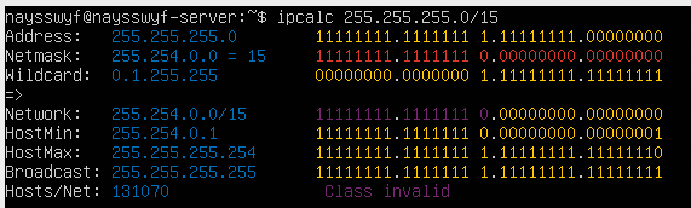
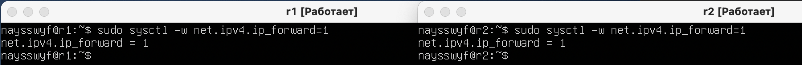
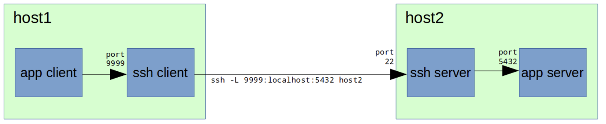

# DO2_LinuxNetwork-1

# Сети в Linux

Настройка сетей в Linux на виртуальных машинах.

## Contents

## 1. [Инструмент ipcalc](#part-1-инструмент-ipcalc)
## 2. [Статическая маршрутизация между двумя машинами](#part-2-статическая-маршрутизация-между-двумя-машинами)
## 3. [Утилита iperf3](#part-3-утилита-iperf3)
## 4. [Сетевой экран](#part-4-сетевой-экран)
## 5. [Статическая маршрутизация сети](#part-5-статическая-маршрутизация-сети)
## 6. [Динамическая настройка IP с помощью DHCP](#part-6-динамическая-настройка-ip-с-помощью-dhcp)
## 7. [NAT](#part-7-nat)
## 8. [Допополнительно. Знакомство с SSH Tunnels](#part-8-дополнительно-знакомство-с-ssh-tunnels)

## Part 1. Инструмент **ipcalc**

## 1.1. Сети и маски
## Определи и запиши в отчёт:
## 1) Адрес сети *192.167.38.54/13*:

## результат выполнения команды "ipcalc 192.167.38.54/13"
## адрес сети в поле Network: 192.160.0.0

## 2) Перевод маски *255.255.255.0* в префиксную и двоичную запись, */15* в обычную и двоичную, *11111111.11111111.11111111.11110000* в обычную и префиксную

## результат выполнения команды "ipcalc 255.255.255.0/24"
## Префикс маски - это короткая запись сетевой маски, определяет количество бит порции сети. В префиксной равен 24 (три полных октета 3 х 8 = 24)
## Двоичная запись - в поле Netmask: 11111111.11111111.11111111.00000000

## результат выполнения команды "ipcalc 255.255.255.0/15"
## 15 = 16 -1, т.е. один полный октет и второй без 1, тогда в обычной: 255.254.0.0; в двоичной (поле Network) -  11111111.11111110.00000000.00000000

## 11111111.11111111.11111111.11110000 - три полных октета по 8 и один неполный 4(111000 = 240), поэтому в обычной 255.255.255.240
## в префиксном виде 3х8 + 4 = 24 + 4 = 28.

## результат выполнения команды "ipcalc 255.255.255.240/28"

## 3) Минимальный и максимальный хост в сети *12.167.38.4* при масках: */8*, *11111111.11111111.00000000.00000000*, *255.255.254.0* и */4*

## 11111111.11111111.00000000.00000000 соответствует префиксу 16 (/16)
## при маске 255.255.254.0 воспользуемся записью с маской в обычном виде (ipcalc 12.167.38.4 255.255.254.0)

## 1.2. localhost
## Определи и запиши в отчёт, можно ли обратиться к приложению, работающему на localhost, со следующими IP: *194.34.23.100*, *127.0.0.2*, *127.1.0.1*, *128.0.0.1*

## localhost (так называемый, «местный» от англ. local, или «локальный хост», по смыслу — этот компьютер) — в компьютерных сетях, стандартное, официально зарезервированное доменное имя для частных IP-адресов (в диапазоне 127.0.0.1 — 127.255.255.254.

## 194.34.23.100 - нет
## 127.0.0.2 - да
## 127.1.0.1 - да
## 128.0.0.1 - нет

## 1.3. Диапазоны и сегменты сетей
## Определи и запиши в отчёт:
## 1) Какие из перечисленных IP можно использовать в качестве публичного, а какие только в качестве частных: *10.0.0.45*, *134.43.0.2*, *192.168.4.2*, *172.20.250.4*, *172.0.2.1*, *192.172.0.1*, *172.68.0.2*, *172.16.255.255*, *10.10.10.10*, *192.169.168.1*

## Частный IP-адрес(англ. private IP address), также называемый внутренним, внутрисетевым или локальным — IP-адрес, принадлежащий к специальному диапазону, не используемому в сети Интернет. Такие адреса предназначены для применения в локальных сетях, распределение таких адресов никем не контролируется. В связи с дефицитом свободных IP-адресов провайдеры всё чаще раздают своим абонентам именно внутрисетевые адреса, а не внешние, при этом они все выходят в интернет через один внешний IP (так называемый «белый IP»).
## диапазоны частных IP-адресов:
## 10.0.0.0 — 10.255.255.255 (маска подсети для бесклассовой (CIDR) адресации: 255.0.0.0 или /8);
## 100.64.0.0 — 100.127.255.255 (маска подсети 255.192.0.0 или /10). Данная подсеть рекомендована согласно RFC 6598 для использования в качестве адресов для CGN (Carrier-Grade NAT);
## 172.16.0.0 — 172.31.255.255 (маска подсети: 255.240.0.0 или /12);
## 192.168.0.0 — 192.168.255.255 (маска подсети: 255.255.0.0 или /16).

## Публичный IP-адрес — это IP-адрес, уникальность которого определяется не в локальной сети, а глобально, во всей сети интернет. Если вашему компьютеру присвоен публичный IP-адрес, то его возможности во взаимодействии с другими компьютерами (устройствами) сети интернет не ограничены.
## диапазоны публичных IP-адресов:
## 0.0.0.0	—	126.255.255.255
## 128.0.0.0	—	191.255.255.255
## 192.0.0.0	—	223.255.255.255
## 224.0.0.0	—	239.255.255.255
## 240.0.0.0	—	255.255.255.255

## 10.0.0.45 - Частный
## 134.43.0.2 - Публичный
## 192.168.4.2 - Частный
## 172.20.250.4 - Частный
## 172.0.2.1 - Публичный
## 192.172.0.1 - Публичный
## 172.68.0.2 - Публичный
## 172.16.255.255 - Частный
## 10.10.10.10 - Частный
## 192.169.168.1 - Публичный

## 2) Какие из перечисленных IP адресов шлюза возможны у сети *10.10.0.0/18*: *10.0.0.1*, *10.10.0.2*, *10.10.10.10*, *10.10.100.1*, *10.10.1.255*

## HostMin - 10.10.0.1, HostMax - 10.10.63.254, поэтому возможны 10.10.0.2, 10.10.10.10, 10.10.1.255

## Part 2. Статическая маршрутизация между двумя машинами

## Подними две виртуальные машины (далее -- ws1 и ws2).

## С помощью команды `ip a` посмотри существующие сетевые интерфейсы.

## Опиши сетевой интерфейс, соответствующий внутренней сети, на обеих машинах и задать следующие адреса и маски: ws1 - *192.168.100.10*, маска */16*, ws2 - *172.24.116.8*, маска */12*.

## Выполни команду `netplan apply` для перезапуска сервиса сети.

## 2.1. Добавление статического маршрута вручную

## Добавь статический маршрут от одной машины до другой и обратно при помощи команды вида `ip r add`.
## Пропингуй соединение между машинами.

## 2.2. Добавление статического маршрута с сохранением
## Перезапусти машины.
## Добавь статический маршрут от одной машины до другой с помощью файла *etc/netplan/00-installer-config.yaml*.

## Пропингуй соединение между машинами.

## Part 3. Утилита **iperf3**

## 3.1. Скорость соединения
## Переведи и запиши в отчёт: 8 Mbps в MB/s, 100 MB/s в Kbps, 1 Gbps в Mbps.
## 8Mbps = 1MB/s (1 байт = 8 бит).
## 100MB/s = 819200 Kbps.(100MB  = 102400KB (* 1024), 102400KB  = 819200Kbp (*8)).
## 1Gbps = 1024Mbps.

#### 3.2. Утилита **iperf3**
##### Измерь скорость соединения между ws1 и ws2.

## вторую машину запускаем в режиме сервера (iperf3 -s)
## первую - в режиме клиента, указывая ip-адрес второй машины (iperf3 -c 172.24.116.8 -fM) (флаг -fM, скорость в мегабайтах).

## Part 4. Сетевой экран

## 4.1. Утилита **iptables**
## Создай файл */etc/firewall.sh*, имитирующий фаерволл, на ws1 и ws2:
## Нужно добавить в файл подряд следующие правила:
## 1) На ws1 примени стратегию, когда в начале пишется запрещающее правило, а в конце пишется разрешающее правило (это касается пунктов 4 и 5).
## 2) На ws2 примени стратегию, когда в начале пишется разрешающее правило, а в конце пишется запрещающее правило (это касается пунктов 4 и 5).
## 3) Открой на машинах доступ для порта 22 (ssh) и порта 80 (http).
## 4) Запрети *echo reply* (машина не должна «пинговаться», т.е. должна быть блокировка на OUTPUT).
## 5) Разреши *echo reply* (машина должна «пинговаться»).

## Запусти файлы на обеих машинах командами `chmod +x /etc/firewall.sh` и `/etc/firewall.sh`.

## Разница между стратегиями в порядке выполнения запрещающего и разрешающего правил. На первой машине последним выполняется разрешающее правило, поэтому пингуется. На второй наоборот, поэтому не пингуется.

## 4.2. Утилита **nmap**
## nmap (Network Mapper) - сетевой картограф, инструмент для исследования сети и проверки безопасности.
## Командой **ping** найди машину, которая не «пингуется», после чего утилитой **nmap** покажи, что хост машины запущен.

## Part 5. Статическая маршрутизация сети

Сеть: \

## Подними пять виртуальных машин (3 рабочие станции (ws11, ws21, ws22) и 2 роутера (r1, r2)).

## 5.1. Настройка адресов машин
## Настрой конфигурации машин в *etc/netplan/00-installer-config.yaml* согласно сети на рисунке.

## Перезапусти сервис сети. Если ошибок нет, то командой `ip -4 a` проверь, что адрес машины задан верно. Также пропингуй ws22 с ws21. Аналогично пропингуй r1 с ws11.

## проверка адреса (ip -4 a)

## пингование r1 & ws11 / ws22 & ws21:

## 5.2. Включение переадресации IP-адресов
##### Для включения переадресации IP, выполни команду на роутерах:
`sysctl -w net.ipv4.ip_forward=1`

## Открой файл */etc/sysctl.conf* и добавь в него следующую строку:
`net.ipv4.ip_forward = 1`

## 5.3. Установка маршрута по-умолчанию

## Настрой маршрут по-умолчанию (шлюз) для рабочих станций. Для этого добавь `default` перед IP роутера в файле конфигураций.

## Вызови `ip r` и покажи, что добавился маршрут в таблицу маршрутизации.

## Пропингуй с ws11 роутер r2 и покажи на r2, что пинг доходит. Для этого используй команду:
`tcpdump -tn -i eth0`

## 5.4. Добавление статических маршрутов
## Добавь в роутеры r1 и r2 статические маршруты в файле конфигураций. Пример для r1 маршрута в сетку 10.20.0.0/26:

## Вызови `ip r` и покажи таблицы с маршрутами на обоих роутерах. Пример таблицы на r1:

## Запусти команды на ws11:
`ip r list 10.10.0.0/[маска сети]` и `ip r list 0.0.0.0/0`

- объясни, почему для адреса 10.10.0.0/\[маска сети\] был выбран маршрут, отличный от 0.0.0.0/0, хотя он попадает под маршрут по-умолчанию:
## маршрут по умолчанию имеет более низкий приоритет, срабатывает, когда не найден подходящий маршрут.

## 5.5. Построение списка маршрутизаторов
Пример вывода утилиты **traceroute** после добавления шлюза:

## Запусти на r1 команду дампа:
## результат команды traceroute 10.20.0.10 (трассировка ws11 & ws21) и tcpdump -tnv -i eth0

## При помощи утилиты **traceroute** построй список маршрутизаторов на пути от ws11 до ws21.
## По протоколу UDP (User Datagram Protocol – «протокол пользовательских датаграмм») Traceroute отправляет последовательность IP-пакетов. Всего таких пакетов по умолчанию может быть 3. Первый пакет имеет время жизни (также известное как TTL (Time To Live) или лимит переходов), равное 1, второй пакет имеет TTL=2 и так далее. Каждый раз, когда пакет передается новому маршрутизатору, TTL уменьшается на 1. Это сделано для предотвращения проблем с зацикливанием между серверами. Если бы не было TTL, пакет мог бы бесконечно долго перебрасываться между серверами. Когда время жизни достигает 0, пакет отбрасывается, а маршрутизатор возвращает сообщение об ошибке. Отправляя пакеты таким образом, Traceroute гарантирует, что каждый маршрутизатор на пути отклонит пакет и отправит ответ.

## 5.6. Использование протокола **ICMP** при маршрутизации
## Запусти на r1 перехват сетевого трафика, проходящего через eth0 с помощью команды:
`tcpdump -n -i eth0 icmp`
## Пропингуй с ws11 несуществующий IP (например, *10.30.0.111*) с помощью команды:
`ping -c 1 10.30.0.111`

## Сохрани дампы образов виртуальных машин.
**P.S. Ни в коем случае не сохраняй дампы в гит!**

## Part 6. Динамическая настройка IP с помощью **DHCP**

## Для r2 настрой в файле */etc/dhcp/dhcpd.conf* конфигурацию службы **DHCP**:
## 1) Укажи адрес маршрутизатора по-умолчанию, DNS-сервер и адрес внутренней сети. Пример файла для r2:

## 2) В файле *resolv.conf* пропиши `nameserver 8.8.8.8`.

##### Перезагрузи службу **DHCP** командой `systemctl restart isc-dhcp-server`. Машину ws21 перезагрузи при помощи `reboot` и через `ip a` покажи, что она получила адрес. Также пропингуй ws22 с ws21.

## Укажи MAC адрес у ws11, для этого в *etc/netplan/00-installer-config.yaml* надо добавить строки: `macaddress: 10:10:10:10:10:BA`, `dhcp4: true`.

## Для r1 настрой аналогично r2, но сделай выдачу адресов с жесткой привязкой к MAC-адресу (ws11). Проведи аналогичные тесты.

## Запроси с ws11 обновление ip адреса.
## ip до обновления:

## ip после обновления:

## Для машины ws21 использовалось динимичекое получение ip - адреса; для машины ws11 - статичекое.

## Part 7. **NAT**

## В файле */etc/apache2/ports.conf* на ws22 и r1 измени строку `Listen 80` на `Listen 0.0.0.0:80`, то есть сделай сервер Apache2 общедоступным.

## Запусти веб-сервер Apache командой `service apache2 start` на ws22 и r1.

## Добавь в фаервол, созданный по аналогии с фаерволом из Части 4, на r2 следующие правила:
## 1) Удаление правил в таблице filter - `iptables -F`;
## 2) Удаление правил в таблице "NAT" - `iptables -F -t nat`;
## 3) Отбрасывать все маршрутизируемые пакеты - `iptables --policy FORWARD DROP`.

## Запусти файл также, как в Части 4.

## Проверь соединение между ws22 и r1 командой `ping`.

*При запуске файла с этими правилами, ws22 не должна «пинговаться» с r1.*

## Добавь в файл ещё одно правило:
## 4) Разрешить маршрутизацию всех пакетов протокола **ICMP**.

## Запусти файл также, как в Части 4.

## Проверь соединение между ws22 и r1 командой `ping`.

*При запуске файла с этими правилами, ws22 должна «пинговаться» с r1.*

## Добавь в файл ещё два правила:
## 5) Включи **SNAT**, а именно маскирование всех локальных ip из локальной сети, находящейся за r2 (по обозначениям из Части 5 - сеть 10.20.0.0).

*Совет: стоит подумать о маршрутизации внутренних пакетов, а также внешних пакетов с установленным соединением.*

## 6) Включи **DNAT** на 8080 порт машины r2 и добавить к веб-серверу Apache, запущенному на ws22, доступ извне сети.
*Совет: стоит учесть, что при попытке подключения возникнет новое tcp-соединение, предназначенное ws22 и 80 порту.*

## Запусти файл также, как в Части 4.
## Проверь соединение по TCP для **SNAT**: для этого с ws22 подключиться к серверу Apache на r1 командой:
`telnet [адрес] [порт]`

## Проверь соединение по TCP для **DNAT**: для этого с r1 подключиться к серверу Apache на ws22 командой `telnet [адрес] [порт]` (обращаться по адресу r2 и порту 8080).

## Сохрани дампы образов виртуальных машин.
**P.S. Ни в коем случае не сохраняй дампы в гит!**

## Part 8. Дополнительно. Знакомство с **SSH Tunnels**

## Запусти на r2 фаервол с правилами из Части 7.

##### Запусти веб-сервер **Apache** на ws22 только на localhost (то есть в файле */etc/apache2/ports.conf* измени строку `Listen 80` на `Listen localhost:80`).

## Воспользуйся *Local TCP forwarding* с ws21 до ws22, чтобы получить доступ к веб-серверу на ws22 с ws21.

## Воспользуйся *Remote TCP forwarding* c ws11 до ws22, чтобы получить доступ к веб-серверу на ws22 с ws11.

## Для проверки, сработало ли подключение в обоих предыдущих пунктах, перейди во второй терминал (например, клавишами Alt + F2) и выполни команду:
`telnet 127.0.0.1 [локальный порт]`

## the end.
